# System Architecture Document
## AI Board Game Agent System

**Version:** 1.0  
**Date:** February 13, 2026  
**Status:** Draft

---

## Table of Contents

1. [Overview](#1-overview)
2. [System Architecture](#2-system-architecture)
3. [Component Architecture](#3-component-architecture)
4. [Data Architecture](#4-data-architecture)
5. [AI Provider Architecture](#5-ai-provider-architecture)
6. [Rules Engine Architecture](#6-rules-engine-architecture)
7. [Reinforcement Learning Architecture](#7-reinforcement-learning-architecture)
8. [Sequence Flows](#8-sequence-flows)
9. [Technology Stack](#9-technology-stack)
10. [Deployment Architecture](#10-deployment-architecture)
11. [Security Architecture](#11-security-architecture)

---

## 1. Overview

### 1.1 Architecture Principles

- **Separation of Concerns**: Game logic, AI providers, and rules engine are independent
- **Data-Driven**: Games defined in database, not code
- **Provider Agnostic**: Support multiple AI providers through common interface
- **Extensible**: Easy to add new games, providers, and player types
- **Testable**: Components can be tested in isolation

### 1.2 High-Level Architecture

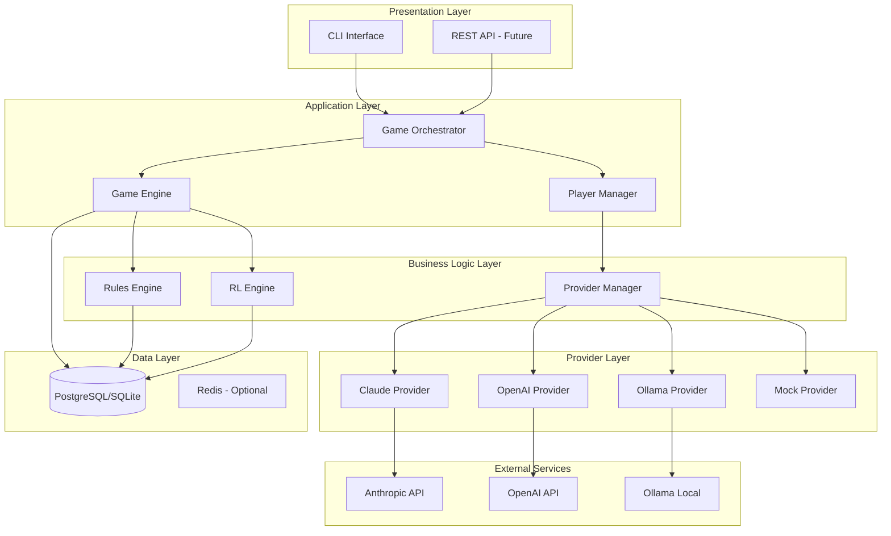
```mermaid
graph TB
    subgraph "Presentation Layer"
        CLI[CLI Interface]
        API[REST API - Future]
    end
    
    subgraph "Application Layer"
        Orchestrator[Game Orchestrator]
        GameEngine[Game Engine]
        PlayerMgr[Player Manager]
    end
    
    subgraph "Business Logic Layer"
        RulesEngine[Rules Engine]
        RLEngine[RL Engine]
        ProviderMgr[Provider Manager]
    end
    
    subgraph "Provider Layer"
        Claude[Claude Provider]
        OpenAI[OpenAI Provider]
        Ollama[Ollama Provider]
        Mock[Mock Provider]
    end
    
    subgraph "Data Layer"
        DB[(PostgreSQL/SQLite)]
        Cache[Redis - Optional]
    end
    
    subgraph "External Services"
        AnthropicAPI[Anthropic API]
        OpenAIAPI[OpenAI API]
        OllamaLocal[Ollama Local]
    end
    
    CLI --> Orchestrator
    API --> Orchestrator
    
    Orchestrator --> GameEngine
    Orchestrator --> PlayerMgr
    
    GameEngine --> RulesEngine
    GameEngine --> RLEngine
    GameEngine --> DB
    
    PlayerMgr --> ProviderMgr
    RulesEngine --> DB
    RLEngine --> DB
    
    ProviderMgr --> Claude
    ProviderMgr --> OpenAI
    ProviderMgr --> Ollama
    ProviderMgr --> Mock
    
    Claude --> AnthropicAPI
    OpenAI --> OpenAIAPI
    Ollama --> OllamaLocal
```

---

## 2. System Architecture

### 2.1 Layered Architecture

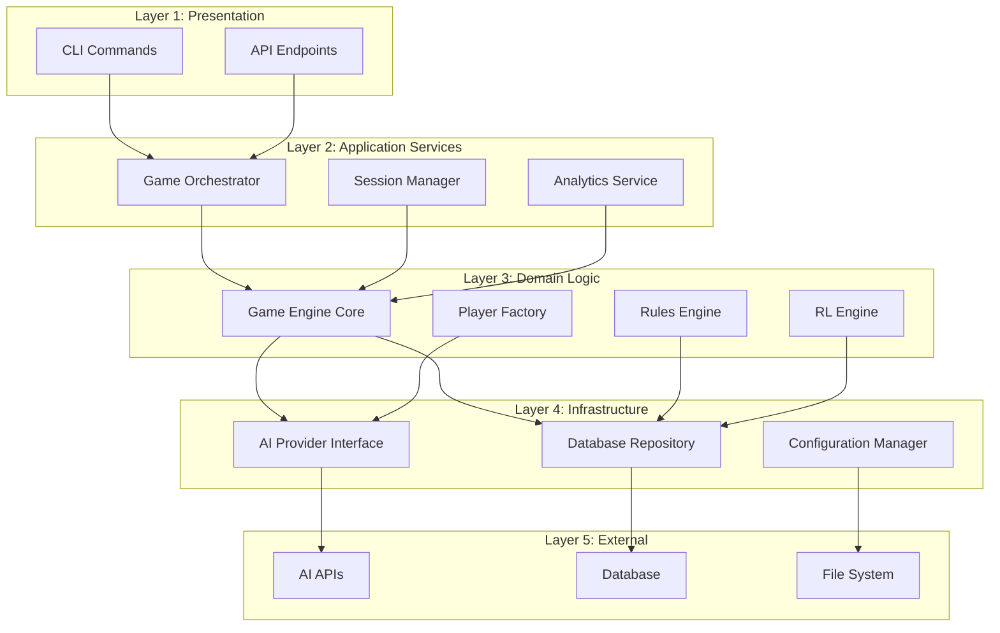
```mermaid
graph TB
    subgraph "Layer 1: Presentation"
        L1A[CLI Commands]
        L1B[API Endpoints]
    end
    
    subgraph "Layer 2: Application Services"
        L2A[Game Orchestrator]
        L2B[Session Manager]
        L2C[Analytics Service]
    end
    
    subgraph "Layer 3: Domain Logic"
        L3A[Game Engine Core]
        L3B[Rules Engine]
        L3C[RL Engine]
        L3D[Player Factory]
    end
    
    subgraph "Layer 4: Infrastructure"
        L4A[AI Provider Interface]
        L4B[Database Repository]
        L4C[Configuration Manager]
    end
    
    subgraph "Layer 5: External"
        L5A[AI APIs]
        L5B[Database]
        L5C[File System]
    end
    
    L1A --> L2A
    L1B --> L2A
    L2A --> L3A
    L2B --> L3A
    L2C --> L3A
    
    L3A --> L4A
    L3A --> L4B
    L3B --> L4B
    L3C --> L4B
    L3D --> L4A
    
    L4A --> L5A
    L4B --> L5B
    L4C --> L5C
```

### 2.2 Component Interaction

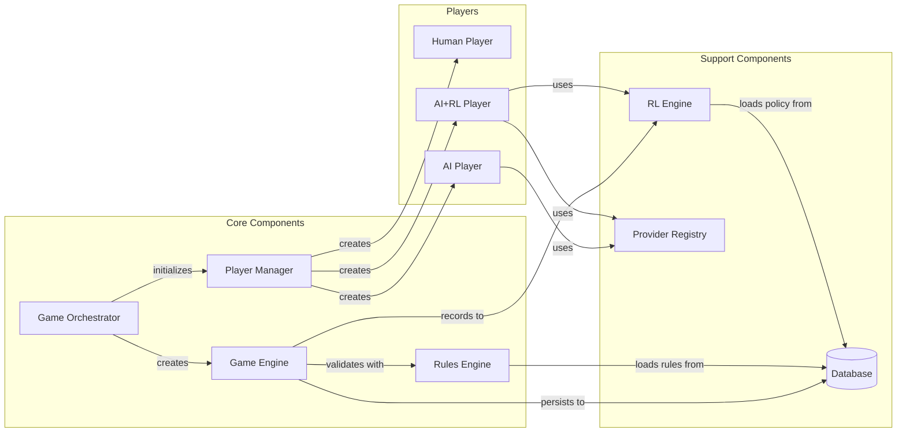
```mermaid
graph LR
    subgraph "Core Components"
        GO[Game Orchestrator]
        GE[Game Engine]
        RE[Rules Engine]
        PM[Player Manager]
    end
    
    subgraph "Support Components"
        RLE[RL Engine]
        PR[Provider Registry]
        DB[(Database)]
    end
    
    subgraph "Players"
        H[Human Player]
        AI[AI Player]
        AIRL[AI+RL Player]
    end
    
    GO -->|creates| GE
    GO -->|initializes| PM
    GE -->|validates with| RE
    GE -->|records to| RLE
    GE -->|persists to| DB
    
    PM -->|creates| H
    PM -->|creates| AI
    PM -->|creates| AIRL
    
    AI -->|uses| PR
    AIRL -->|uses| PR
    AIRL -->|uses| RLE
    
    RE -->|loads rules from| DB
    RLE -->|loads policy from| DB
```

---

## 3. Component Architecture

### 3.1 Game Engine

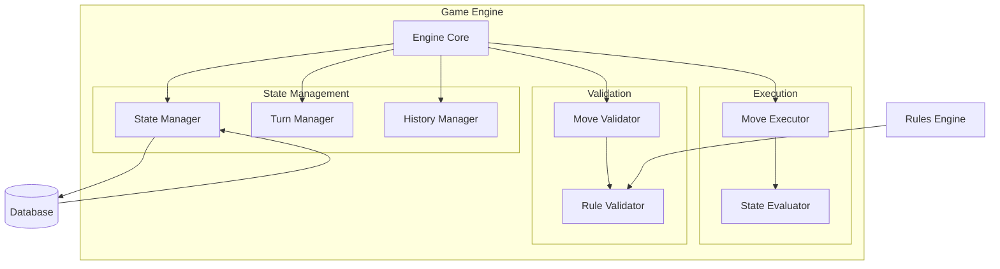
```mermaid
graph TB
    subgraph "Game Engine"
        Core[Engine Core]
        
        subgraph "State Management"
            SM[State Manager]
            TM[Turn Manager]
            HM[History Manager]
        end
        
        subgraph "Validation"
            MV[Move Validator]
            RV[Rule Validator]
        end
        
        subgraph "Execution"
            ME[Move Executor]
            SE[State Evaluator]
        end
        
        Core --> SM
        Core --> TM
        Core --> HM
        
        Core --> MV
        MV --> RV
        
        Core --> ME
        ME --> SE
    end
    
    RulesEngine[Rules Engine] --> RV
    Database[(Database)] --> SM
    SM --> Database
```

**Responsibilities:**
- Orchestrate game flow
- Manage game state
- Coordinate with rules engine
- Execute validated moves
- Track move history
- Detect win/loss conditions

### 3.2 Player Manager

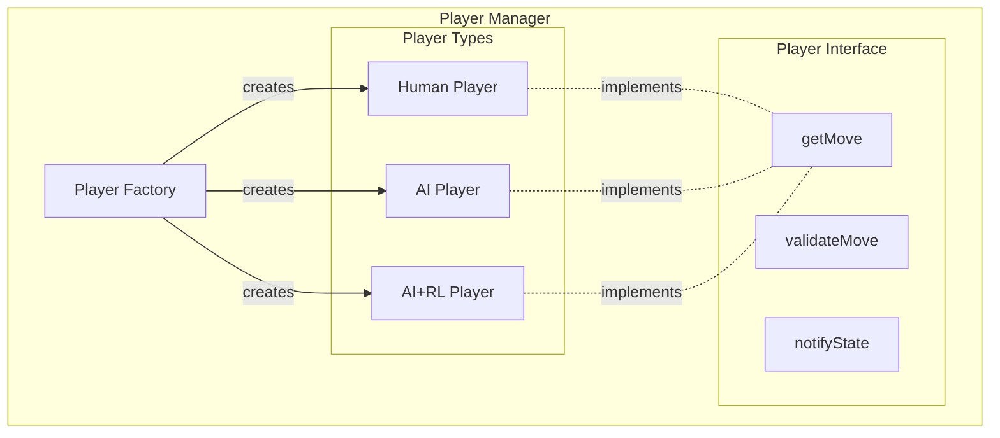
```mermaid
graph TB
    subgraph "Player Manager"
        Factory[Player Factory]
        
        subgraph "Player Types"
            Human[Human Player]
            AIBase[AI Player]
            AIRL[AI+RL Player]
        end
        
        subgraph "Player Interface"
            GetMove[getMove]
            Validate[validateMove]
            Notify[notifyState]
        end
        
        Factory -->|creates| Human
        Factory -->|creates| AIBase
        Factory -->|creates| AIRL
        
        Human -.implements.- GetMove
        AIBase -.implements.- GetMove
        AIRL -.implements.- GetMove
    end
```

**Player Interface:**
```typescript
interface Player {
  getMove(state: GameState): Promise<Move>;
  notifyState(state: GameState): void;
  getType(): PlayerType;
}
```

### 3.3 Session Manager

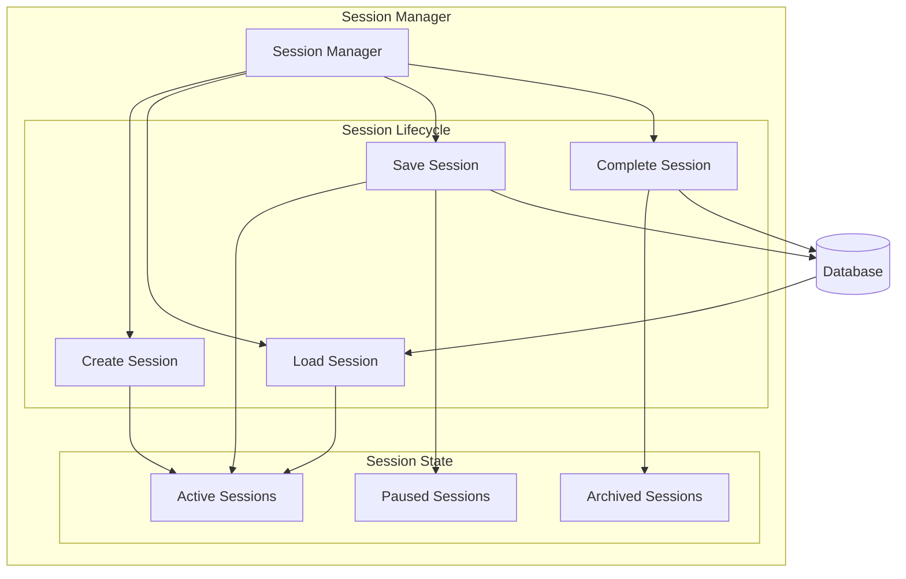
```mermaid
graph TB
    subgraph "Session Manager"
        SM[Session Manager]
        
        subgraph "Session Lifecycle"
            Create[Create Session]
            Load[Load Session]
            Save[Save Session]
            Complete[Complete Session]
        end
        
        subgraph "Session State"
            Active[Active Sessions]
            Paused[Paused Sessions]
            Archive[Archived Sessions]
        end
        
        SM --> Create
        SM --> Load
        SM --> Save
        SM --> Complete
        
        Create --> Active
        Load --> Active
        Save --> Active
        Save --> Paused
        Complete --> Archive
    end
    
    DB[(Database)] --> Load
    Save --> DB
    Complete --> DB
```

---

## 4. Data Architecture

### 4.1 Database Schema

**Note:** All primary keys use UUIDv7 format for time-ordered, sortable identifiers.

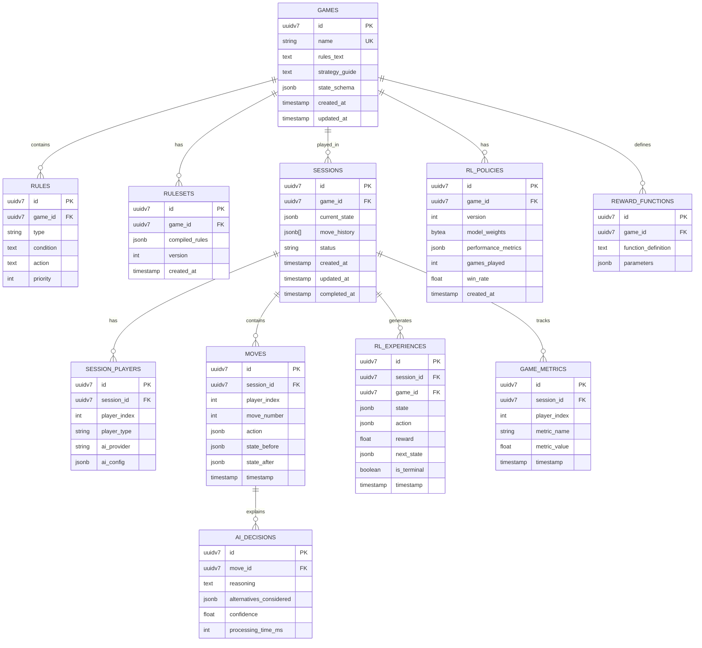
```mermaid
erDiagram
    GAMES ||--o{ RULES : contains
    GAMES ||--o{ RULESETS : has
    GAMES ||--o{ SESSIONS : played_in
    GAMES ||--o{ RL_POLICIES : has
    GAMES ||--o{ REWARD_FUNCTIONS : defines
    
    SESSIONS ||--o{ SESSION_PLAYERS : has
    SESSIONS ||--o{ MOVES : contains
    SESSIONS ||--o{ RL_EXPERIENCES : generates
    SESSIONS ||--o{ GAME_METRICS : tracks
    
    MOVES ||--o{ AI_DECISIONS : explains
    
    GAMES {
        uuidv7 id PK
        string name UK
        text rules_text
        text strategy_guide
        jsonb state_schema
        timestamp created_at
        timestamp updated_at
    }
    
    RULES {
        uuidv7 id PK
        uuidv7 game_id FK
        string type
        text condition
        text action
        int priority
    }
    
    RULESETS {
        uuidv7 id PK
        uuidv7 game_id FK
        jsonb compiled_rules
        int version
        timestamp created_at
    }
    
    SESSIONS {
        uuidv7 id PK
        uuidv7 game_id FK
        jsonb current_state
        jsonb[] move_history
        string status
        timestamp created_at
        timestamp updated_at
        timestamp completed_at
    }
    
    SESSION_PLAYERS {
        uuidv7 id PK
        uuidv7 session_id FK
        int player_index
        string player_type
        string ai_provider
        jsonb ai_config
    }
    
    MOVES {
        uuidv7 id PK
        uuidv7 session_id FK
        int player_index
        int move_number
        jsonb action
        jsonb state_before
        jsonb state_after
        timestamp timestamp
    }
    
    RL_EXPERIENCES {
        uuidv7 id PK
        uuidv7 session_id FK
        uuidv7 game_id FK
        jsonb state
        jsonb action
        float reward
        jsonb next_state
        boolean is_terminal
        timestamp timestamp
    }
    
    RL_POLICIES {
        uuidv7 id PK
        uuidv7 game_id FK
        int version
        bytea model_weights
        jsonb performance_metrics
        int games_played
        float win_rate
        timestamp created_at
    }
    
    REWARD_FUNCTIONS {
        uuidv7 id PK
        uuidv7 game_id FK
        text function_definition
        jsonb parameters
    }
    
    GAME_METRICS {
        uuidv7 id PK
        uuidv7 session_id FK
        int player_index
        string metric_name
        float metric_value
        timestamp timestamp
    }
    
    AI_DECISIONS {
        uuidv7 id PK
        uuidv7 move_id FK
        text reasoning
        jsonb alternatives_considered
        float confidence
        int processing_time_ms
    }
```

### 4.2 Data Flow

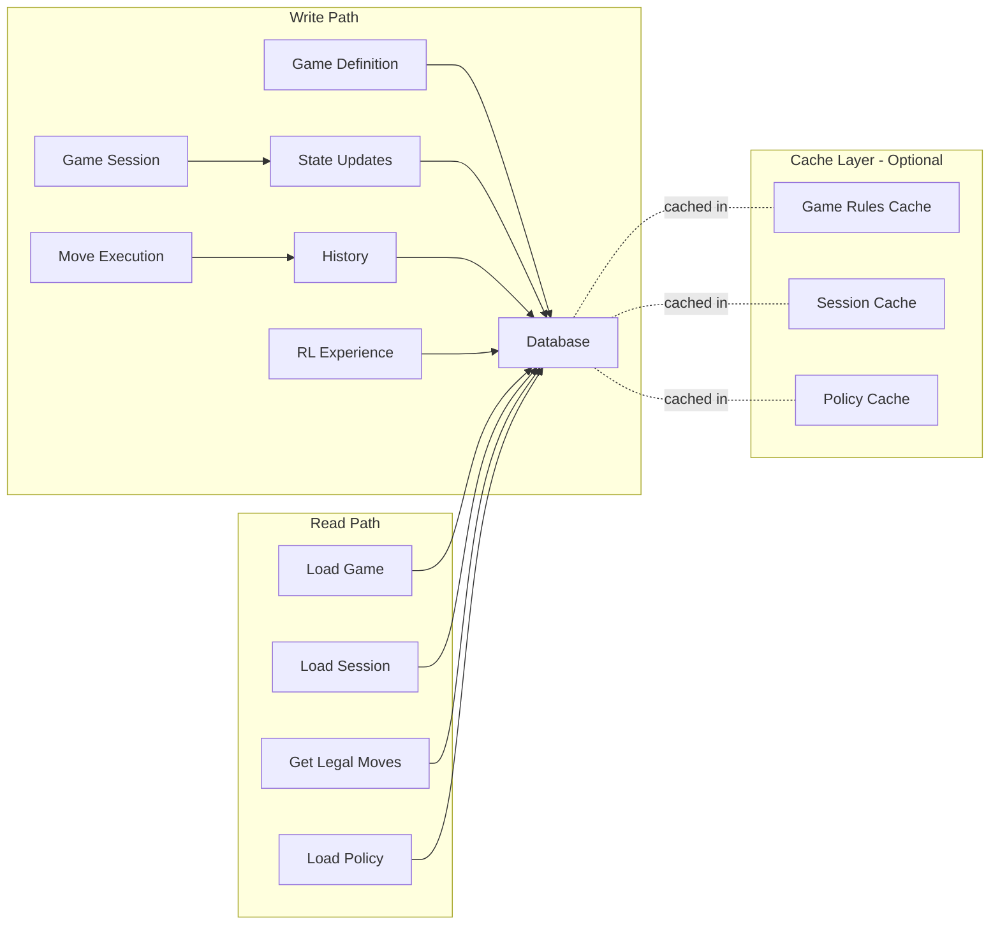
```mermaid
flowchart LR
    subgraph "Write Path"
        W1[Game Definition] --> W2[Database]
        W3[Game Session] --> W4[State Updates]
        W4 --> W2
        W5[Move Execution] --> W6[History]
        W6 --> W2
        W7[RL Experience] --> W2
    end
    
    subgraph "Read Path"
        R1[Load Game] --> W2
        R2[Load Session] --> W2
        R3[Get Legal Moves] --> W2
        R4[Load Policy] --> W2
    end
    
    subgraph "Cache Layer - Optional"
        C1[Game Rules Cache]
        C2[Session Cache]
        C3[Policy Cache]
    end
    
    W2 -.cached in.- C1
    W2 -.cached in.- C2
    W2 -.cached in.- C3
```

---

## 5. AI Provider Architecture

### 5.1 Provider Pattern

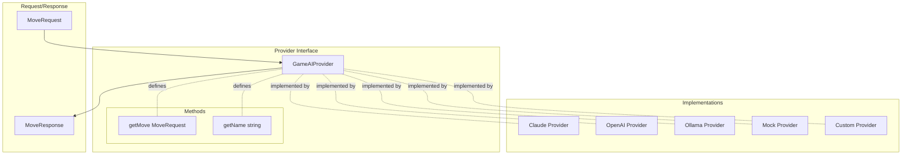
```mermaid
graph TB
    subgraph "Provider Interface"
        Interface[GameAIProvider]
        
        subgraph "Methods"
            GetMove[getMove MoveRequest]
            GetName[getName string]
        end
        
        Interface -.defines.- GetMove
        Interface -.defines.- GetName
    end
    
    subgraph "Request/Response"
        Request[MoveRequest]
        Response[MoveResponse]
        
        Request --> Interface
        Interface --> Response
    end
    
    subgraph "Implementations"
        Claude[Claude Provider]
        OpenAI[OpenAI Provider]
        Ollama[Ollama Provider]
        Mock[Mock Provider]
        Custom[Custom Provider]
    end
    
    Interface -.implemented by.- Claude
    Interface -.implemented by.- OpenAI
    Interface -.implemented by.- Ollama
    Interface -.implemented by.- Mock
    Interface -.implemented by.- Custom
```

### 5.2 Provider Request/Response Flow

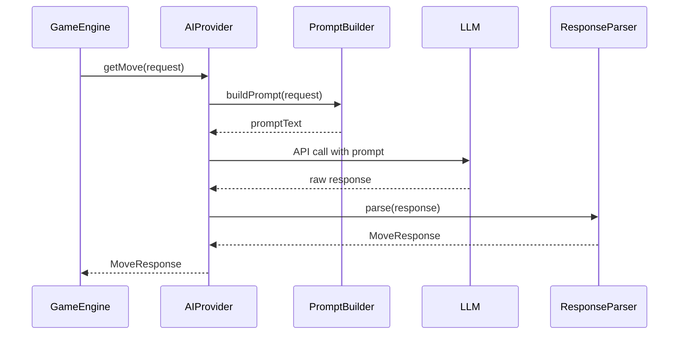
```mermaid
sequenceDiagram
    participant GameEngine
    participant AIProvider
    participant PromptBuilder
    participant LLM
    participant ResponseParser
    
    GameEngine->>AIProvider: getMove(request)
    AIProvider->>PromptBuilder: buildPrompt(request)
    PromptBuilder-->>AIProvider: promptText
    AIProvider->>LLM: API call with prompt
    LLM-->>AIProvider: raw response
    AIProvider->>ResponseParser: parse(response)
    ResponseParser-->>AIProvider: MoveResponse
    AIProvider-->>GameEngine: MoveResponse
```

### 5.3 Provider Configuration

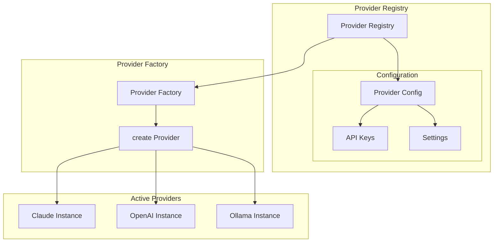
```mermaid
graph TB
    subgraph "Provider Registry"
        Registry[Provider Registry]
        
        subgraph "Configuration"
            Config[Provider Config]
            Credentials[API Keys]
            Settings[Settings]
        end
        
        Registry --> Config
        Config --> Credentials
        Config --> Settings
    end
    
    subgraph "Provider Factory"
        Factory[Provider Factory]
        Create[create Provider]
    end
    
    Registry --> Factory
    Factory --> Create
    
    subgraph "Active Providers"
        P1[Claude Instance]
        P2[OpenAI Instance]
        P3[Ollama Instance]
    end
    
    Create --> P1
    Create --> P2
    Create --> P3
```

**Provider Configuration Schema:**
```typescript
{
  provider: 'claude' | 'openai' | 'ollama' | 'custom',
  options: {
    apiKey?: string,
    model?: string,
    baseUrl?: string,
    temperature?: number,
    maxTokens?: number
  }
}
```

---

## 6. Rules Engine Architecture

### 6.1 Rules Engine Components

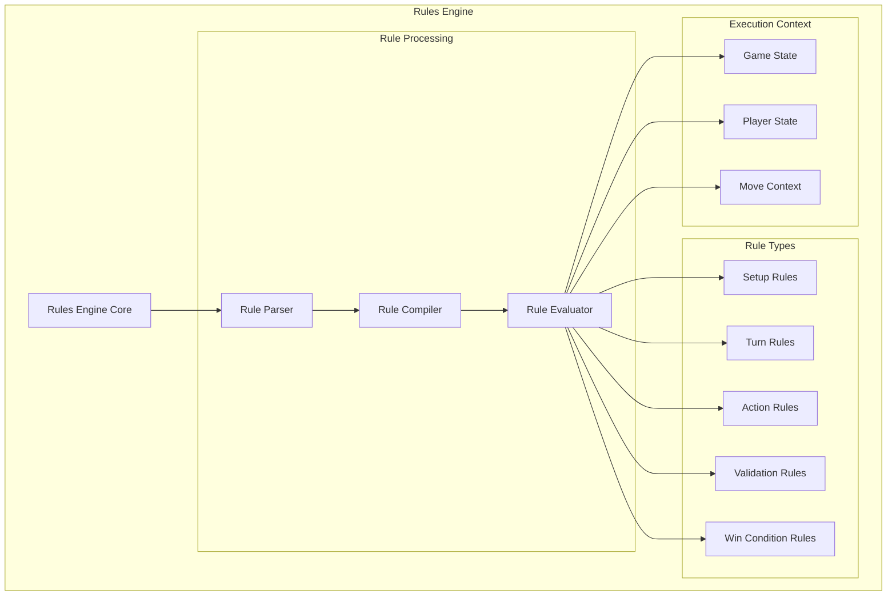
```mermaid
graph TB
    subgraph "Rules Engine"
        Core[Rules Engine Core]
        
        subgraph "Rule Processing"
            Parser[Rule Parser]
            Compiler[Rule Compiler]
            Evaluator[Rule Evaluator]
        end
        
        subgraph "Rule Types"
            Setup[Setup Rules]
            Turn[Turn Rules]
            Action[Action Rules]
            Validation[Validation Rules]
            Win[Win Condition Rules]
        end
        
        subgraph "Execution Context"
            State[Game State]
            Player[Player State]
            Move[Move Context]
        end
        
        Core --> Parser
        Parser --> Compiler
        Compiler --> Evaluator
        
        Evaluator --> Setup
        Evaluator --> Turn
        Evaluator --> Action
        Evaluator --> Validation
        Evaluator --> Win
        
        Evaluator --> State
        Evaluator --> Player
        Evaluator --> Move
    end
```

### 6.2 Rule Definition Language (DSL)

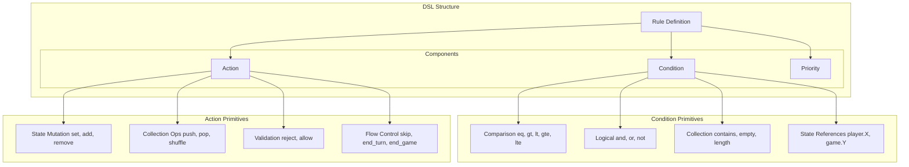
```mermaid
graph TB
    subgraph "DSL Structure"
        Rule[Rule Definition]
        
        subgraph "Components"
            Condition[Condition]
            Action[Action]
            Priority[Priority]
        end
        
        Rule --> Condition
        Rule --> Action
        Rule --> Priority
    end
    
    subgraph "Condition Primitives"
        C1[Comparison eq, gt, lt, gte, lte]
        C2[Logical and, or, not]
        C3[Collection contains, empty, length]
        C4[State References player.X, game.Y]
    end
    
    subgraph "Action Primitives"
        A1[State Mutation set, add, remove]
        A2[Collection Ops push, pop, shuffle]
        A3[Validation reject, allow]
        A4[Flow Control skip, end_turn, end_game]
    end
    
    Condition --> C1
    Condition --> C2
    Condition --> C3
    Condition --> C4
    
    Action --> A1
    Action --> A2
    Action --> A3
    Action --> A4
```

### 6.3 Rule Evaluation Flow

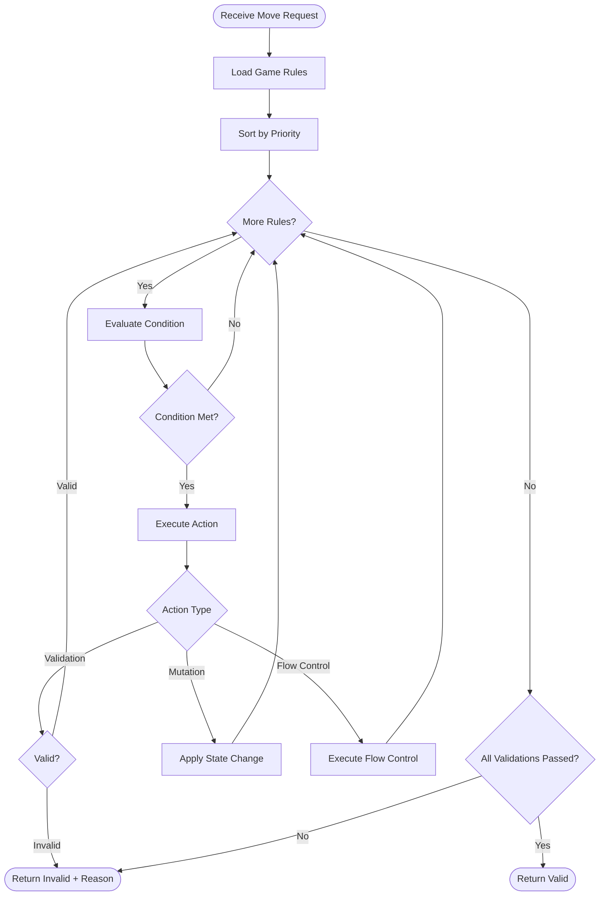
```mermaid
flowchart TD
    Start([Receive Move Request]) --> LoadRules[Load Game Rules]
    LoadRules --> SortRules[Sort by Priority]
    SortRules --> Loop{More Rules?}
    
    Loop -->|Yes| EvalCondition[Evaluate Condition]
    EvalCondition --> CondResult{Condition Met?}
    
    CondResult -->|Yes| ExecAction[Execute Action]
    CondResult -->|No| Loop
    
    ExecAction --> ActionType{Action Type}
    
    ActionType -->|Validation| CheckValid{Valid?}
    ActionType -->|Mutation| ApplyChange[Apply State Change]
    ActionType -->|Flow Control| FlowAction[Execute Flow Control]
    
    CheckValid -->|Invalid| Return([Return Invalid + Reason])
    CheckValid -->|Valid| Loop
    
    ApplyChange --> Loop
    FlowAction --> Loop
    
    Loop -->|No| FinalCheck{All Validations Passed?}
    FinalCheck -->|Yes| ReturnValid([Return Valid])
    FinalCheck -->|No| Return
```

### 6.4 Example Rule Representation

**JSON Format:**
```json
{
  "type": "validation",
  "name": "card_must_be_higher",
  "priority": 100,
  "condition": {
    "and": [
      {
        "not_empty": "game.discard_pile"
      },
      {
        "lte": [
          {"ref": "move.card.value"},
          {"ref": "game.discard_pile[0].value"}
        ]
      }
    ]
  },
  "action": {
    "reject": "Card must be higher than top of discard pile"
  }
}
```

**DSL Format (Alternative):**
```
RULE card_must_be_higher
  PRIORITY 100
  WHEN game.discard_pile IS NOT EMPTY
   AND move.card.value <= game.discard_pile[0].value
  THEN REJECT "Card must be higher than top of discard pile"
END
```

---

## 7. Reinforcement Learning Architecture

### 7.1 RL System Components

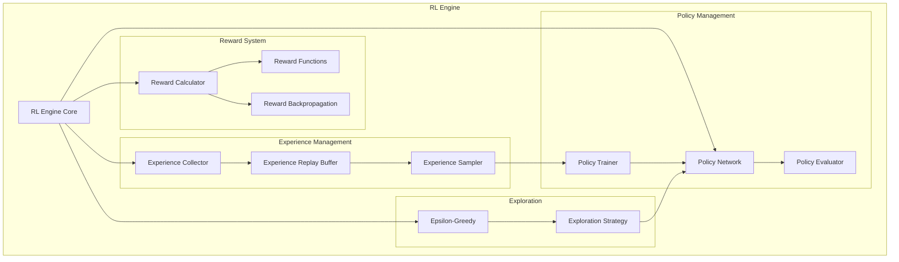
```mermaid
graph TB
    subgraph "RL Engine"
        Core[RL Engine Core]
        
        subgraph "Experience Management"
            Collector[Experience Collector]
            Buffer[Experience Replay Buffer]
            Sampler[Experience Sampler]
        end
        
        subgraph "Reward System"
            RewardCalc[Reward Calculator]
            RewardFunc[Reward Functions]
            Backprop[Reward Backpropagation]
        end
        
        subgraph "Policy Management"
            Policy[Policy Network]
            Trainer[Policy Trainer]
            Evaluator[Policy Evaluator]
        end
        
        subgraph "Exploration"
            Epsilon[Epsilon-Greedy]
            Explorer[Exploration Strategy]
        end
        
        Core --> Collector
        Collector --> Buffer
        Buffer --> Sampler
        
        Core --> RewardCalc
        RewardCalc --> RewardFunc
        RewardCalc --> Backprop
        
        Core --> Policy
        Sampler --> Trainer
        Trainer --> Policy
        Policy --> Evaluator
        
        Core --> Epsilon
        Epsilon --> Explorer
        Explorer --> Policy
    end
```

### 7.2 RL Training Loop

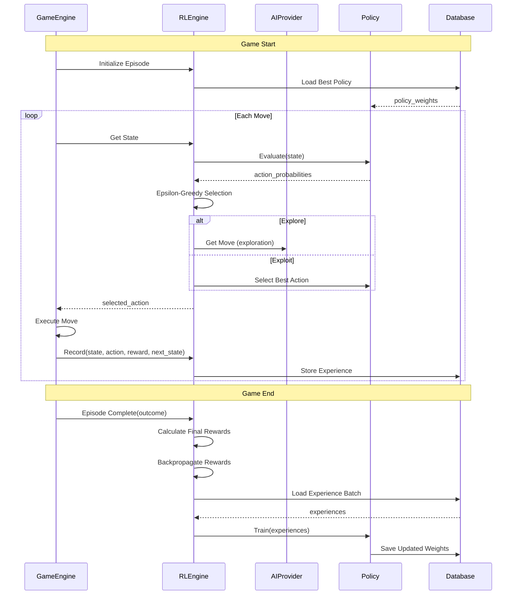
```mermaid
sequenceDiagram
    participant GameEngine
    participant RLEngine
    participant AIProvider
    participant Policy
    participant Database
    
    Note over GameEngine,Database: Game Start
    GameEngine->>RLEngine: Initialize Episode
    RLEngine->>Database: Load Best Policy
    Database-->>Policy: policy_weights
    
    loop Each Move
        GameEngine->>RLEngine: Get State
        RLEngine->>Policy: Evaluate(state)
        Policy-->>RLEngine: action_probabilities
        RLEngine->>RLEngine: Epsilon-Greedy Selection
        
        alt Explore
            RLEngine->>AIProvider: Get Move (exploration)
        else Exploit
            RLEngine->>Policy: Select Best Action
        end
        
        RLEngine-->>GameEngine: selected_action
        GameEngine->>GameEngine: Execute Move
        GameEngine->>RLEngine: Record(state, action, reward, next_state)
        RLEngine->>Database: Store Experience
    end
    
    Note over GameEngine,Database: Game End
    GameEngine->>RLEngine: Episode Complete(outcome)
    RLEngine->>RLEngine: Calculate Final Rewards
    RLEngine->>RLEngine: Backpropagate Rewards
    RLEngine->>Database: Load Experience Batch
    Database-->>RLEngine: experiences
    RLEngine->>Policy: Train(experiences)
    Policy->>Database: Save Updated Weights
```

### 7.3 Reward Structure

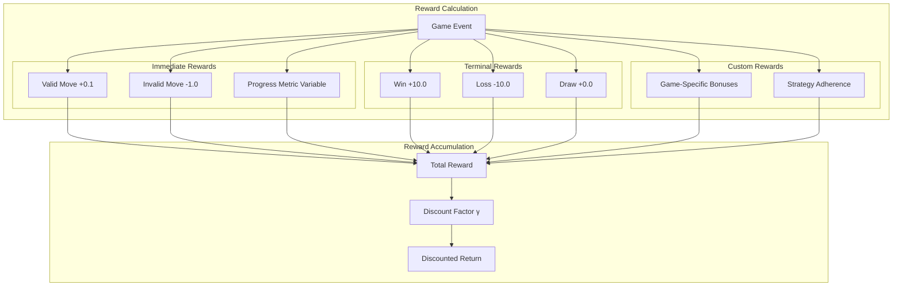
```mermaid
graph TB
    subgraph "Reward Calculation"
        Event[Game Event]
        
        subgraph "Immediate Rewards"
            Valid[Valid Move +0.1]
            Invalid[Invalid Move -1.0]
            Progress[Progress Metric Variable]
        end
        
        subgraph "Terminal Rewards"
            Win[Win +10.0]
            Loss[Loss -10.0]
            Draw[Draw +0.0]
        end
        
        subgraph "Custom Rewards"
            GameSpecific[Game-Specific Bonuses]
            Strategy[Strategy Adherence]
        end
        
        Event --> Valid
        Event --> Invalid
        Event --> Progress
        Event --> Win
        Event --> Loss
        Event --> Draw
        Event --> GameSpecific
        Event --> Strategy
    end
    
    subgraph "Reward Accumulation"
        Sum[Total Reward]
        Discount[Discount Factor γ]
        Final[Discounted Return]
    end
    
    Valid --> Sum
    Invalid --> Sum
    Progress --> Sum
    Win --> Sum
    Loss --> Sum
    Draw --> Sum
    GameSpecific --> Sum
    Strategy --> Sum
    
    Sum --> Discount
    Discount --> Final
```

### 7.4 Policy Integration with AI Provider

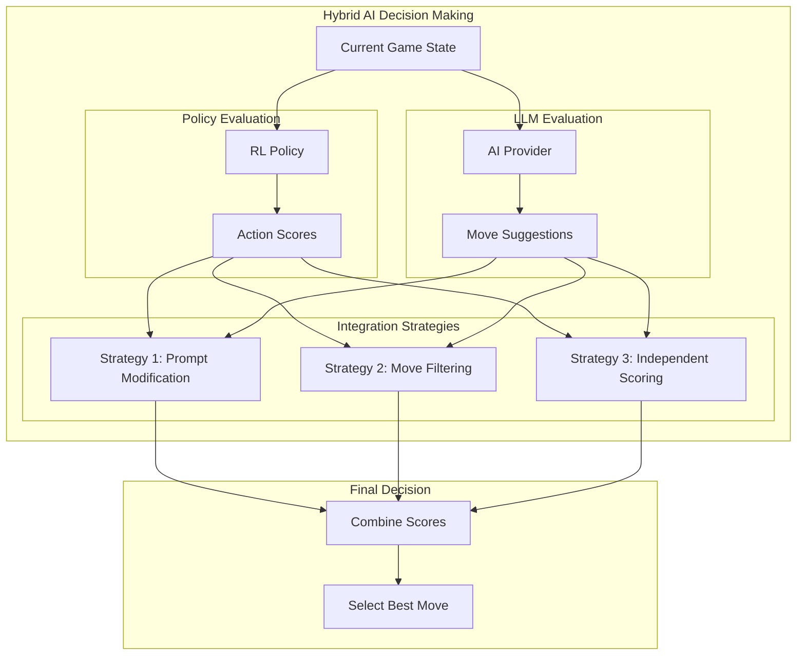
```mermaid
graph TB
    subgraph "Hybrid AI Decision Making"
        State[Current Game State]
        
        subgraph "Policy Evaluation"
            Policy[RL Policy]
            ActionScores[Action Scores]
        end
        
        subgraph "LLM Evaluation"
            Provider[AI Provider]
            LLMSuggestions[Move Suggestions]
        end
        
        subgraph "Integration Strategies"
            S1[Strategy 1: Prompt Modification]
            S2[Strategy 2: Move Filtering]
            S3[Strategy 3: Independent Scoring]
        end
        
        State --> Policy
        State --> Provider
        
        Policy --> ActionScores
        Provider --> LLMSuggestions
        
        ActionScores --> S1
        LLMSuggestions --> S1
        
        ActionScores --> S2
        LLMSuggestions --> S2
        
        ActionScores --> S3
        LLMSuggestions --> S3
    end
    
    subgraph "Final Decision"
        Combine[Combine Scores]
        Select[Select Best Move]
    end
    
    S1 --> Combine
    S2 --> Combine
    S3 --> Combine
    Combine --> Select
```

**Integration Strategy Options:**

1. **Prompt Modification**: Include policy preferences in AI prompt
   - "Based on past experience, moves X and Y have been successful in similar positions"

2. **Move Filtering**: Policy filters AI suggestions
   - AI generates candidates, policy ranks them

3. **Independent Scoring**: Weighted combination
   - `final_score = α * policy_score + (1-α) * llm_score`

---

## 8. Sequence Flows

### 8.1 New Game Session Flow

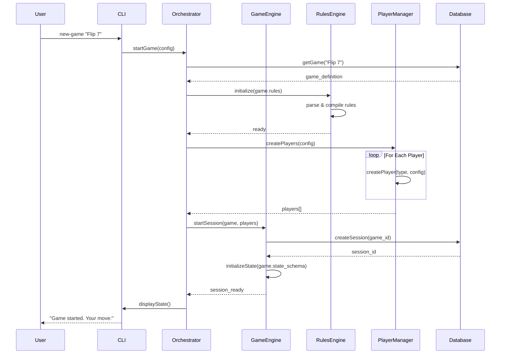
```mermaid
sequenceDiagram
    participant User
    participant CLI
    participant Orchestrator
    participant GameEngine
    participant RulesEngine
    participant PlayerManager
    participant Database
    
    User->>CLI: new-game "Flip 7"
    CLI->>Orchestrator: startGame(config)
    
    Orchestrator->>Database: getGame("Flip 7")
    Database-->>Orchestrator: game_definition
    
    Orchestrator->>RulesEngine: initialize(game.rules)
    RulesEngine->>RulesEngine: parse & compile rules
    RulesEngine-->>Orchestrator: ready
    
    Orchestrator->>PlayerManager: createPlayers(config)
    
    loop For Each Player
        PlayerManager->>PlayerManager: createPlayer(type, config)
    end
    
    PlayerManager-->>Orchestrator: players[]
    
    Orchestrator->>GameEngine: startSession(game, players)
    GameEngine->>Database: createSession(game_id)
    Database-->>GameEngine: session_id
    
    GameEngine->>GameEngine: initializeState(game.state_schema)
    GameEngine-->>Orchestrator: session_ready
    
    Orchestrator->>CLI: displayState()
    CLI-->>User: "Game started. Your move:"
```

### 8.2 Move Execution Flow

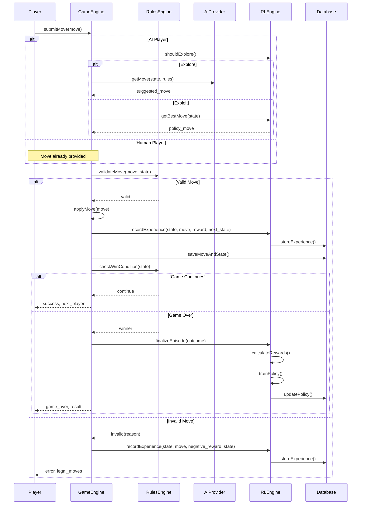
```mermaid
sequenceDiagram
    participant Player
    participant GameEngine
    participant RulesEngine
    participant AIProvider
    participant RLEngine
    participant Database
    
    Player->>GameEngine: submitMove(move)
    
    alt AI Player
        GameEngine->>RLEngine: shouldExplore()
        alt Explore
            GameEngine->>AIProvider: getMove(state, rules)
            AIProvider-->>GameEngine: suggested_move
        else Exploit
            GameEngine->>RLEngine: getBestMove(state)
            RLEngine-->>GameEngine: policy_move
        end
    else Human Player
        Note over Player,GameEngine: Move already provided
    end
    
    GameEngine->>RulesEngine: validateMove(move, state)
    
    alt Valid Move
        RulesEngine-->>GameEngine: valid
        GameEngine->>GameEngine: applyMove(move)
        GameEngine->>RLEngine: recordExperience(state, move, reward, next_state)
        RLEngine->>Database: storeExperience()
        GameEngine->>Database: saveMoveAndState()
        GameEngine->>RulesEngine: checkWinCondition(state)
        
        alt Game Continues
            RulesEngine-->>GameEngine: continue
            GameEngine-->>Player: success, next_player
        else Game Over
            RulesEngine-->>GameEngine: winner
            GameEngine->>RLEngine: finalizeEpisode(outcome)
            RLEngine->>RLEngine: calculateRewards()
            RLEngine->>RLEngine: trainPolicy()
            RLEngine->>Database: updatePolicy()
            GameEngine-->>Player: game_over, result
        end
        
    else Invalid Move
        RulesEngine-->>GameEngine: invalid(reason)
        GameEngine->>RLEngine: recordExperience(state, move, negative_reward, state)
        RLEngine->>Database: storeExperience()
        GameEngine-->>Player: error, legal_moves
    end
```

### 8.3 AI Move Generation Flow

```mermaid
sequenceDiagram
    participant GameEngine
    participant AIPlayer
    participant ProviderManager
    participant ClaudeProvider
    participant RLEngine
    participant Database
    
    GameEngine->>AIPlayer: getMove(state)
    AIPlayer->>Database: getRelevantMemories(game_id)
    Database-->>AIPlayer: memories[]
    
    alt RL-Enhanced Player
        AIPlayer->>RLEngine: getPolicyGuidance(state)
        RLEngine->>Database: loadPolicy(game_id)
        Database-->>RLEngine: policy_weights
        RLEngine->>RLEngine: evaluate(state)
        RLEngine-->>AIPlayer: action_preferences
    end
    
    AIPlayer->>ProviderManager: getProvider("claude")
    ProviderManager-->>AIPlayer: provider_instance
    
    AIPlayer->>ClaudeProvider: getMove(request)
    Note over ClaudeProvider: request includes:<br/>- rules<br/>- strategy<br/>- state<br/>- history<br/>- memories<br/>- policy guidance (if RL)
    
    ClaudeProvider->>ClaudeProvider: buildPrompt()
    ClaudeProvider->>Claude API: messages.create()
    Claude API-->>ClaudeProvider: response
    ClaudeProvider->>ClaudeProvider: parseResponse()
    
    alt Parse Success
        ClaudeProvider-->>AIPlayer: {move, reasoning}
        AIPlayer-->>GameEngine: move
    else Parse Failure
        ClaudeProvider->>ClaudeProvider: retry with clarification
        alt Retry Success
            ClaudeProvider-->>AIPlayer: {move, reasoning}
        else Max Retries
            ClaudeProvider-->>AIPlayer: error
            AIPlayer->>AIPlayer: fallback to random legal move
        end
    end
    
    AIPlayer->>Database: logDecision(move, reasoning, alternatives)
```

### 8.4 RL Training Flow

```mermaid
sequenceDiagram
    participant Trainer
    participant RLEngine
    participant Database
    participant PolicyNetwork
    
    Note over Trainer,PolicyNetwork: Post-Game Training
    
    Trainer->>RLEngine: trainPolicy(game_id)
    RLEngine->>Database: getRecentExperiences(game_id, limit)
    Database-->>RLEngine: experiences[]
    
    RLEngine->>RLEngine: calculateDiscountedReturns()
    
    loop Training Epochs
        RLEngine->>Database: sampleBatch(batch_size)
        Database-->>RLEngine: batch[]
        
        RLEngine->>PolicyNetwork: forward(states)
        PolicyNetwork-->>RLEngine: predicted_values
        
        RLEngine->>RLEngine: calculateLoss(predicted, actual)
        RLEngine->>PolicyNetwork: backward(loss)
        PolicyNetwork->>PolicyNetwork: updateWeights()
    end
    
    RLEngine->>PolicyNetwork: evaluate(validation_set)
    PolicyNetwork-->>RLEngine: performance_metrics
    
    alt Performance Improved
        RLEngine->>Database: savePolicy(weights, metrics, version++)
        Database-->>RLEngine: saved
    else Performance Declined
        RLEngine->>RLEngine: keep previous policy
    end
    
    RLEngine-->>Trainer: training_complete
```

---

## 9. Technology Stack

### 9.1 Core Technologies

```mermaid
graph TB
    subgraph "Runtime"
        Node[Node.js 18+]
        TS[TypeScript 5+]
    end
    
    subgraph "Database & ORM"
        PG[PostgreSQL 15+]
        SQLite[SQLite 3.40+]
        TypeORM[TypeORM]
    end
    
    subgraph "AI Providers"
        Anthropic[Anthropic SDK]
        OpenAISDK[OpenAI SDK]
        OllamaClient[Ollama Client]
    end
    
    subgraph "Testing"
        Jest[Jest]
        Mock[Mock Providers]
    end
    
    subgraph "Development"
        ESLint[ESLint]
        Prettier[Prettier]
        TSNode[ts-node]
    end
    
    Node --> TS
    TS --> PG
    TS --> SQLite
    TS --> Anthropic
    TS --> OpenAISDK
    TS --> OllamaClient
```

### 9.2 Dependencies

**Core Dependencies:**
```json
{
  "@anthropic-ai/sdk": "^0.30.0",
  "openai": "^4.0.0",
  "typeorm": "^0.3.20",
  "uuidv7": "^1.0.0",
  "pg": "^8.11.0",
  "sqlite3": "^5.1.0",
  "reflect-metadata": "^0.2.0",
  "commander": "^11.0.0",
  "express": "^4.18.0",
  "tsoa": "^6.0.0",
  "dotenv": "^16.0.0"
}
```

**Development Dependencies:**
```json
{
  "typescript": "^5.3.0",
  "ts-node": "^10.9.0",
  "@types/node": "^20.0.0",
  "@types/pg": "^8.10.0",
  "jest": "^29.7.0",
  "eslint": "^8.50.0",
  "prettier": "^3.0.0"
}
```

### 9.3 Project Structure

```
ai-board-game-agent/
├── src/
│   ├── cli/                    # CLI interface (current priority)
│   │   ├── commands/
│   │   └── index.ts
│   ├── api/                    # REST API (future - tsoa-based)
│   │   ├── resources/
│   │   │   ├── games/
│   │   │   │   ├── games.resource.ts
│   │   │   │   ├── games.controller.ts
│   │   │   │   └── games.service.ts
│   │   │   ├── sessions/
│   │   │   └── moves/
│   │   ├── shared/
│   │   ├── routes.ts           # Generated by tsoa
│   │   └── swagger.json        # Generated by tsoa
│   ├── core/                   # Core domain logic
│   │   ├── game-engine/
│   │   ├── rules-engine/
│   │   ├── rl-engine/
│   │   └── player-manager/
│   ├── providers/              # AI provider implementations
│   │   ├── interface.ts
│   │   ├── claude.ts
│   │   ├── openai.ts
│   │   ├── ollama.ts
│   │   └── factory.ts
│   ├── data/                   # Data access layer
│   │   ├── repositories/
│   │   ├── entities/
│   │   └── data-source.ts
│   ├── services/               # Application services
│   │   ├── orchestrator.ts
│   │   ├── session-manager.ts
│   │   └── analytics.ts
│   ├── types/                  # Shared TypeScript types
│   └── utils/                  # Utility functions
├── migrations/                 # Database migrations
├── tests/
│   ├── unit/
│   ├── integration/
│   └── fixtures/
├── config/                     # Configuration files
├── docs/                       # Documentation
│   ├── PRD.md
│   ├── ARCHITECTURE.md
│   └── best-practices/
├── examples/                   # Example game definitions
│   ├── tic-tac-toe.json
│   ├── flip-7.json
│   └── checkers.json
├── .env.example
├── tsconfig.json
├── tsoa.json                   # tsoa configuration
├── package.json
└── README.md
```

---

## 10. Deployment Architecture

### 10.1 Local Development

```mermaid
graph TB
    subgraph "Developer Machine"
        Code[Source Code]
        
        subgraph "Local Services"
            App[Node.js App]
            DB[SQLite DB]
            Ollama[Ollama Local]
        end
        
        Code --> App
        App --> DB
        App --> Ollama
    end
    
    subgraph "External APIs"
        Claude[Claude API]
        OpenAI[OpenAI API]
    end
    
    App -.optional.- Claude
    App -.optional.- OpenAI
```

### 10.2 Production Deployment (Future)

**Note:** Web UI is a future implementation. Current focus is CLI.

**Planned Web UI Stack:**
- React with Vite
- React Query for server state
- PrimeReact for UI components
- CSS Modules with CSS Variables for theming

**Planned REST API Stack:**
- tsoa for TypeScript OpenAPI documentation
- Express for HTTP server
- Resource-based architecture with strict isolation
- One controller per resource, no cross-resource type imports

```mermaid
graph TB
    subgraph "Client Layer"
        CLI[CLI Client - Current Priority]
        Web[Web UI - Future Phase]
    end
    
    subgraph "Application Tier"
        LB[Load Balancer]
        
        subgraph "App Servers"
            App1[App Instance 1]
            App2[App Instance 2]
            AppN[App Instance N]
        end
    end
    
    subgraph "Data Tier"
        Primary[PostgreSQL Primary]
        Replica[PostgreSQL Replica]
        Redis[Redis Cache]
    end
    
    subgraph "External Services"
        Claude[Claude API]
        OpenAI[OpenAI API]
    end
    
    CLI --> LB
    Web --> LB
    
    LB --> App1
    LB --> App2
    LB --> AppN
    
    App1 --> Primary
    App2 --> Primary
    AppN --> Primary
    
    App1 --> Replica
    App2 --> Replica
    AppN --> Replica
    
    App1 --> Redis
    App2 --> Redis
    AppN --> Redis
    
    App1 --> Claude
    App1 --> OpenAI
```

---

## 11. Security Architecture

### 11.1 Security Layers

```mermaid
graph TB
    subgraph "Security Measures"
        
        subgraph "Authentication & Authorization"
            Auth[API Key Management]
            Env[Environment Variables]
        end
        
        subgraph "Data Security"
            Encrypt[Encryption at Rest]
            Transit[TLS for API Calls]
            Sanitize[Input Sanitization]
        end
        
        subgraph "Application Security"
            Validate[Move Validation]
            RateLimit[Rate Limiting]
            Error[Error Handling]
        end
        
        subgraph "Audit & Monitoring"
            Logs[Audit Logs]
            Metrics[Security Metrics]
        end
    end
```

### 11.2 Security Best Practices

**API Key Management:**
- Store in environment variables
- Never commit to version control
- Rotate regularly
- Use separate keys for dev/prod

**Input Validation:**
- Validate all user input
- Sanitize before database insertion
- Validate AI responses before execution
- Use parameterized queries

**Data Protection:**
- Encrypt sensitive data at rest
- Use TLS for all API communications
- Implement proper access controls
- Regular security audits

**Error Handling:**
- Don't expose internal errors to users
- Log security-relevant events
- Implement retry logic with backoff
- Graceful degradation

---

## 12. Performance Considerations

### 12.1 Optimization Strategies

```mermaid
graph TB
    subgraph "Performance Optimizations"
        
        subgraph "Database"
            Index[Indexes on Foreign Keys]
            Partition[Partition Large Tables]
            Archive[Archive Old Sessions]
        end
        
        subgraph "Caching"
            RuleCache[Cache Compiled Rules]
            PolicyCache[Cache Active Policies]
            StateCache[Cache Game States]
        end
        
        subgraph "API Optimization"
            Batch[Batch AI Requests]
            Parallel[Parallel Move Generation]
            Timeout[Request Timeouts]
        end
        
        subgraph "Resource Management"
            Pool[Connection Pooling]
            Memory[Memory Management]
            Cleanup[Periodic Cleanup]
        end
    end
```

### 12.2 Scaling Considerations

**Vertical Scaling:**
- Increase database resources
- More memory for experience buffer
- Faster CPU for policy training

**Horizontal Scaling:**
- Stateless application servers
- Shared database backend
- Distributed cache layer

**Data Scaling:**
- Partition experiences by game_id
- Archive old sessions
- Implement data retention policies

---

## Appendix A: Design Decisions

### A.1 Why Provider Pattern?
- Easy to swap AI models
- Test with mock providers
- Compare model performance
- Cost optimization

### A.2 Why Generic Rules Engine?
- Avoid game-specific code
- Faster game addition
- Consistent validation
- Easier maintenance

### A.3 Why Separate RL Engine?
- Optional feature
- Can be disabled per game
- Independent testing
- Clear separation of concerns

### A.4 Why Database for Game State?
- Persistence across restarts
- Historical analysis
- Resumable games
- Multi-instance support

---

## Appendix B: Future Enhancements

### B.1 Advanced RL Techniques
- Implement PPO (Proximal Policy Optimization)
- Multi-agent RL for competitive games
- Transfer learning across similar games
- Curriculum learning

### B.2 Distributed System Features
- Message queue for async processing
- Microservices architecture
- Event sourcing

### B.3 Advanced Rules Engine
- Visual rule builder
- Rule testing framework
- Rule optimization
- Conflict detection

### B.4 Analytics and Insights
- Win rate tracking
- Strategy effectiveness analysis
- Player skill rating (ELO)
- Move quality assessment
- Decision tree visualization

---

**Document End**
